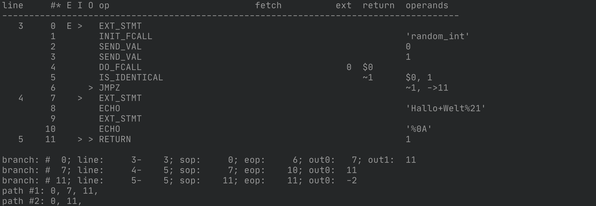
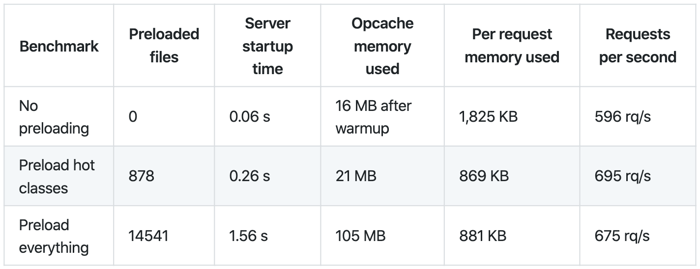

^
Vielen Dank, dass ihr da seid
Schon 2018
Was ist draus geworden
Reise durch die Ausführung und Extensions

# Was ist Preloading 
### Und wie funktioniert das?

---
^
Ich
Sensiolabs
Beispielsweise Migrationsprojekte
Feature Entwicklung

# Wer ist das?
* Lucas Nothnagel
* Software Developer bei Sensiolabs

---
^
Nicht Zeile für Zeile
Lex Pars Compi Inter
Menschenlesbar

# Wie wird PHP-Code ausgeführt?
1. Lexing
2. Parsing
3. Compilation
4. Interpretation

--- 
^ 
- Code String zu Token Stream
- Einfaches Programm

# Lexing oder Tokenizing
## Verwandelt einen Code-String zu eine Token-Stream


[.code-highlight: none]
[.code-highlight: 1-3]
[.code-highlight: 5]
[.code-highlight: 7-14]
[.code-highlight: all]

```php
<?php

$code = '<?php $a = 1 ?>';

$tokens = token_get_all($code);

foreach ($tokens as $token) {
    if (is_array($token)) {
        echo "Line {$token[2]}: ", token_name($token[0]), " ('{$token[1]}')", PHP_EOL;
    } else {
        var_dump($token);
    }
}
```

---
^
- Manche Zeichen sind Tokens
- Beispiel ; : ? =

# PHP-Code
```php
<?php $a = 1 ?>
```

# Token-Stream

```
Line 1: T_OPEN_TAG ('<?php ')
Line 1: T_VARIABLE ('$a')
Line 1: T_WHITESPACE (' ')
string(1) "="
Line 1: T_WHITESPACE (' ')
Line 1: T_LNUMBER ('1')
Line 1: T_WHITESPACE (' ')
Line 1: T_CLOSE_TAG ('?>')
```

---
^
- Ist das Skript logisch? Grammatikcheck
- Fehlendes Semikolon
- AST
- Baumartige Darstellung des Programmcodes

# Parsing
1. Verwendet Token-Stream
2. Grammatik Check (Validierung)
3. Bauen des AST (Abstract Syntax Tree)

```php
<?php

$code = <<<'EOL'
<?php 
    $a = 1;
EOL;

print_r(ast\parse_code($code, 70));
```

---
^
- 132 = Statement List
- 256 = Variable
- 517 = Assignment
- Wert "a"

# AST

[.code-highlight: 1-7, 22-24]
[.code-highlight: 1-11, 20-24]
[.code-highlight: all]

```php
ast\Node Object
(
    [kind] => 132
    [flags] => 0
    [lineno] => 1
    [children] => Array(
        [0] => ast\Node Object(
            [kind] => 517
            [flags] => 0
            [lineno] => 1
            [children] => Array(
                [var] => ast\Node Object(
                    [kind] => 256
                    [flags] => 0
                    [lineno] => 2
                    [children] => Array(
                        [name] => a
                    )
                )
                [expr] => 1
            )
        )
    )
)
```

---

# Compilation
1. Verwendet AST
2. Nimmt optimierungen vor 
   
    ```php
    strlen("abc") = int(3)
    60 * 60 * 24  = int(86400)
    ```
3. Generiert OPCodes

---

# OPCodes
## PHP-Script
```php
<?php

if (random_int(0,1) === 1) {
    echo 'Hallo Welt!', PHP_EOL;
}
```

## Command
```sh
$ php -dvld.active=1 -dvld.execute=0 opcodes.php
```

---



---

# Interpretation
1. Verwendet OPCodes
2. Wird in der Zend Engine VM durchgeführt
3. Der eigentlich Output des Skripts

---

# Zusammenfassend
1. PHP-Code
2. Tokens
3. OPCodes / Bytecode
4. Ausgabe

---

# APC, APCu, OPCache, Preloading, WTF?

---

# Alternative PHP Cache - APC
* Bytecode Cache
* Application Cache - z.B. Queries

---

# APC User Cache - APCu
* Ersetzt teils APC
* Übernimmt nur noch den Application Cache

---

# OPCache
* Ersetzt teils APC
* Übernimmt den Bytecode Cache
* Weitere Optimierungen

---

# Preloading
* Erweitert die Funktion des OPCaches
* Verbindet die OPCodes der einzelnen Dateien

---

# How To Preloading
* Vor dem Auführen werden OPCodes generiert
* Ein Custom PHP-Skript

```php
<?php

$files = /* Preloding Files */;

foreach ($files as $file) {
    opcache_compile_file($file);
}
```
```ini
opcache.preload=/path/to/project/preload.php
```

---

# How To Preloading
* Vor dem Auführen werden OPCodes generiert
* Ein Custom PHP-Skript

```php
<?php

$files = /* Preloding Files */;

foreach ($files as $file) {
    require_once($file);
}
```
```ini
opcache.preload=/path/to/project/preload.php
```

---

# Preloading Hot and Genrated Classes
* Composer preloading support
* Whitelisting
* Blacklisting
* Framework Funktion Integrationen:

```ini
opcache.preload=/path/to/project/var/cache/prod/App_KernelProdContainer.preload.php
```

---



---

# Wo ich abschrieben habe
* https://stitcher.io/blog/preloading-in-php-74
* https://github.com/composer/composer/issues/7777

---

# The End
* Github: scriptibus
* Twitter: @thenothnagel